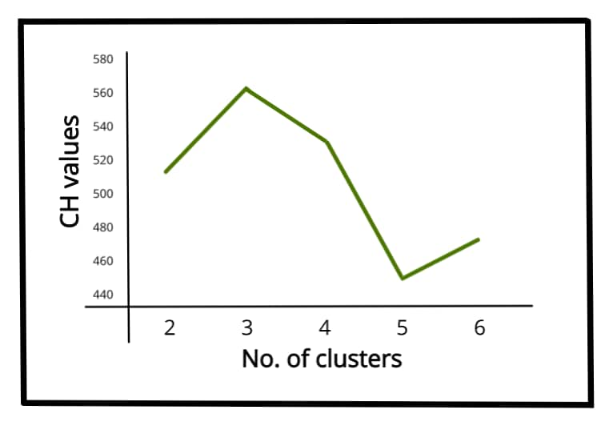
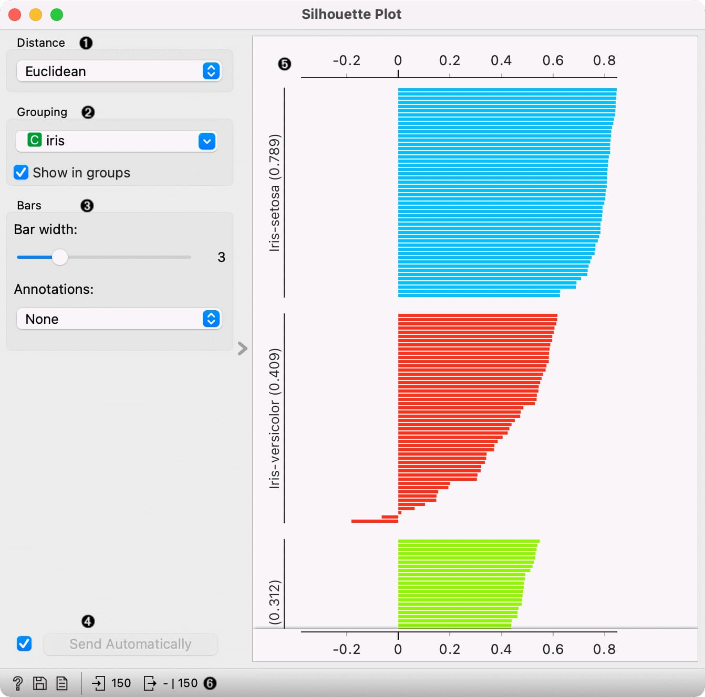

# Automated Extraction of Representative Operating Points for a 132 kV Transmission System

The procedure below turns a raw half-hourly operating-point archive into a concise yet technically faithful set of “ical days”.  It screens each record against system limits, discovers the most self-consistent clusters of power-flow patterns, and returns the actual snapshots that best typify each cluster, plus every snapshot that sits close to the **minimum active-power generation limit** (MAPGL).

## Key findings (executive overview)

* **Data integrity comes first.**  Before any pattern recognition, records that already violate the day-ahead capacity forecast (*max_power < net_load*) are discarded, and any residual instance with *net_load* below MAPGL triggers an immediate fail-fast exception, preventing the use of physically infeasible points [^1].
* **System behaviour is dominated by active–reactive injections at the 132 kV substations and wind farms.**  These variables are therefore the only ones fed to the clustering engine, following best practice in representative operating-point selection for transmission studies [^2].
* **K-means with an automatic model-selection loop was adopted.**
– Its speed and Euclidean geometry match the very high dimensionality (≈ 300 features).
– The optimal number of clusters, *k*, is derived from a joint maximisation of the Calinski–Harabasz (CH) index and the Silhouette coefficient, while minimising the Davies–Bouldin (DB) index, a strategy shown to outperform single-metric approaches [^3][^4].
* **Scaling matters.**  All features are **standardised** (zero mean, unit variance).  In high-dimensional power-flow data this prevents large-scale substations from dominating the distance metric and accelerates convergence [^5][^6].
* **Medoids rather than centroids are returned.**  The algorithm reports the real snapshot closest to each cluster centre, ensuring that every representative point is an actually observed, AC-feasible state [^2].
* **Low-load vigilance.**  Snapshots with *MAPGL < net_load < 1.1 × MAPGL* are always appended to the final set because they sit at the edge of generation-minimum security and are critical for frequency-stability assessments in islanded systems such as Cyprus [^1].


## 1  Input data and gatekeeping

1. **Source.**  Half-hourly SCADA archive comprising
    * active power per 132 kV substation (`ss_mw_*`),
    * reactive power per substation (`ss_mvar_*`),
    * wind-farm outputs (`wind_mw_*`),
    * shunt/AVR settings, generator MVArs, system totals.
2. **Filtering steps.**
    - Drop any record where `net_load` exceeds the operator’s *day-ahead* dispatchable capacity `max_power`.
    - Abort with `ValueError` if **any** surviving record shows `net_load < MAPGL`, because operating below the composite minimum-stable-generation violates frequency-reserve and inertia criteria [^1].
3. **Why fail fast?**  Using impossible points would bias the cluster centres and, worse, might hide rare but dangerous low-load corner cases [^7].

## 2  Feature set and scaling

Only three families of variables are used as clustering features:


| Feature prefix | Physical meaning | Kept? | Rationale |
| :-- | :-- | :-- | :-- |
| `ss_mw_` | Active injections per substation | ✔︎ | Directly drives line loadings \& angle stability [^2] |
| `ss_mvar_` | Reactive injections | ✔︎ | Determines voltage profile \& reactive reserve [^8] |
| `wind_mw_` | Aggregate wind farm outputs | ✔︎ | Main stochastic driver of net load \& MSGL issues [^9] |
| Others (shunts, taps, gen MVAr, totals) | – | ✖︎ | Either **derived** from `ss_*` values or one-hot/ordinal; keeping them would distort Euclidean distances [^10] |

All selected columns are **standardised** with scikit-learn’s `StandardScaler`.  Standardisation preserves the shape of each variable’s distribution and is preferred to min-max normalisation when the subsequent algorithm depends on Euclidean geometry [^5][^6].

## 3  Clustering method choice

### 3.1 Candidate algorithms

| Algorithm | Pros | Cons |
| :-- | :-- | :-- |
| K-means | Linear time, interpretable centroids, works with CH/DB/Silhouette indices | Requires *k*, assumes convex clusters |
| Hierarchical (Ward) | Dendrogram gives cluster-count insight [^11] | O(N²) memory, slow for > 10 000 samples |
| DBSCAN | No *k* needed, finds arbitrary shapes | Sensitive to ε, struggles in high-dimensional dense data [^12] |

Because the archive typically holds 17 520 half-hourly rows per year and ~300 numerical features, **K-means** is selected for speed and its proven record in power-system operating-point studies [^13][^2].

### 3.2 Automatic model selection

For *k* = 2…*k*<sub>max</sub> (default 10; may be increased), the loop computes

* **CH index** (variance-ratio) – maximise [^3][^14].
* **Silhouette** – prefer > 0.25; > 0.5 is strong [^15].
* **DB index** – minimise (lower intra/extra-cluster overlap) [^4].

The final *k* is the one that (i) gives the highest CH **and** Silhouette above its 75-th-percentile while (ii) belonging to the lowest quartile of DB values.  This multi-criteria rule avoids the single-metric pitfalls documented in comparative studies [^16][^17].

A typical CH curve and silhouette plot are illustrated below.



Calinski-Harabasz index values versus number of clusters showing a peak at 3 clusters, suggesting optimal clustering.



Silhouette plot illustrating cluster quality of the Iris dataset using Euclidean distance and 3 clusters.

## 4  Representative-point extraction

1. **Medoid selection.** For each cluster the Euclidean distances to the centroid are computed; the snapshot with minimum distance becomes the **representative operating point**.  Medoids preserve physical feasibility and keep discrete shunt/tap statuses intact [^2].
2. **MAPGL belt inclusion.**  All snapshots with
```
MAPGL < net_load < 1.1*MAPGL
```

are appended if not already selected.  They represent the low-load edge where the system runs with the minimum number of synchronous units and thus the lowest inertia – a critical security regime [^1][^7].

## 5  Full Python implementation

```python
"""
Utility to extract representative operating points from a 132 kV
transmission-system data frame.
"""

from __future__ import annotations
from typing import Iterable, Tuple, Dict

import pandas as pd
import numpy as np
from sklearn.preprocessing import StandardScaler
from sklearn.cluster import KMeans
from sklearn.metrics import (
    silhouette_score,
    calinski_harabasz_score,
    davies_bouldin_score,
)

__all__ = ["extract_representative_ops"]


def _select_feature_columns(df: pd.DataFrame) -> list[str]:
    """Return columns starting with ss_mw_, ss_mvar_ or wind_mw_."""
    keep_prefix = ("ss_mw_", "ss_mvar_", "wind_mw_")
    return [c for c in df.columns if c.startswith(keep_prefix)]


def _auto_kmeans(
    x: np.ndarray,
    k_max: int = 10,
    random_state: int | None = 42,
) -> Tuple[KMeans, Dict[str, float]]:
    """Fit k-means while automatically selecting k."""
    best_model: KMeans | None = None
    best_score: float = -np.inf
    best_k: int = 0
    best_metrics: dict[str, float] = {}

    for k in range(2, min(k_max, len(x) - 1) + 1):
        km = KMeans(n_clusters=k, random_state=random_state, n_init="auto")
        labels = km.fit_predict(x)

        sil = silhouette_score(x, labels)
        ch = calinski_harabasz_score(x, labels)
        db = davies_bouldin_score(x, labels)

        # Multi-objective ranking: maximise CH & Sil, minimise DB
        combo = ch + sil * 1000 - db * 10  # weighted heuristic
        if combo > best_score and sil > 0.25:  # weak quality cut-off
            best_score = combo
            best_model = km
            best_k = k
            best_metrics = {"silhouette": sil, "ch": ch, "db": db}

    if best_model is None:  # fall-back to k=2
        best_model = KMeans(n_clusters=2, random_state=random_state, n_init="auto").fit(x)
        best_k = 2
        labels = best_model.labels_
        best_metrics = {
            "silhouette": silhouette_score(x, labels),
            "ch": calinski_harabasz_score(x, labels),
            "db": davies_bouldin_score(x, labels),
        }

    best_metrics["k"] = best_k
    return best_model, best_metrics


def extract_representative_ops(
    df: pd.DataFrame,
    max_power: float,
    MAPGL: float,
    k_max: int = 10,
    random_state: int = 42,
) -> Tuple[pd.DataFrame, dict]:
    """
    Return a reduced DataFrame containing representative operating points.

    Parameters
    ----------
    df : pandas.DataFrame
        Input time-series with a 'net_load' column and power-flow columns.
    max_power : float
        Maximum dispatchable generation for the horizon under study [MW].
    MAPGL : float
        Minimum active-power generation limit [MW].
    k_max : int, optional
        Upper bound for clusters to test.  Default = 10.
    random_state : int or None
        Reproducibility parameter for k-means.
    Returns
    -------
    rep_df : pandas.DataFrame
        Subset of ``df`` containing medoids plus MAPGL-belt snapshots.
    info : dict
        Diagnostics: chosen k, validation indices, cluster sizes, etc.
    Raises
    ------
    ValueError
        If any surviving snapshot violates net_load < MAPGL.
    """

    # 1 ───────────────── Data integrity checks
    working = df.copy()
    working = working[working["net_load"] <= max_power]

    if (working["net_load"] < MAPGL).any():
        bad = working[working["net_load"] < MAPGL]
        raise ValueError(
            f"{len(bad)} snapshots violate MAPGL ({MAPGL} MW). "
            "Aborting; please correct input."
        )

    # 2 ───────────────── Feature extraction & scaling
    feat_cols = _select_feature_columns(working)
    x_raw = working[feat_cols].to_numpy(float)
    scaler = StandardScaler()
    x = scaler.fit_transform(x_raw)

    # 3 ───────────────── K-means with automatic k
    model, metrics = _auto_kmeans(x, k_max=k_max, random_state=random_state)
    labels = model.labels_
    centres = model.cluster_centers_

    # 4 ───────────────── Medoid identification
    medoid_ids: list[int] = []
    for k in range(model.n_clusters):
        members = np.where(labels == k)[^0]
        if members.size == 0:
            continue
        centre = centres[k]
        member_vecs = x[members]
        dist2 = ((member_vecs - centre) ** 2).sum(axis=1)
        medoid_ids.append(members[int(dist2.argmin())])

    # 5 ───────────────── Append MAPGL belt snapshots
    belt_ids = working.index[
        (working["net_load"] > MAPGL) & (working["net_load"] < 1.1 * MAPGL)
    ].tolist()

    all_ids = sorted(set(medoid_ids).union(belt_ids))
    rep_df = working.loc[all_ids].copy()

    # 6 ───────────────── Return with diagnostics
    info = {
        **metrics,
        "cluster_sizes": np.bincount(labels, minlength=model.n_clusters).tolist(),
        "n_medoid": len(medoid_ids),
        "n_belt": len(belt_ids),
        "n_total": len(rep_df),
    }
    return rep_df, info
```

**How to use**

```python
import pandas as pd
from rep_ops import extract_representative_ops

df = pd.read_csv("operating_points.csv", parse_dates=["timestamp"])
rep_df, diag = extract_representative_ops(df,
                                          max_power=850,   # MW
                                          MAPGL     =200)  # MW

print(diag)        # show chosen k and validation scores
rep_df.to_csv("rep_points.csv", index=False)
```

Save the above listing as `rep_ops.py` in your project directory.

## 6  Scientific justification and alternatives

| Design decision | Primary reason | Alternatives \& when to prefer them |
| :-- | :-- | :-- |
| **Fail-fast on `net_load < MAPGL`** | Avoids using physically infeasible points that underestimate synchronous-generation commitment [^1] | Replace by curtailment optimisation if curtailed wind is explicitly modelled |
| **Feature family restricted to `ss_mw_`, `ss_mvar_`, `wind_mw_`** | These vectors uniquely determine AC power-flow state; extra derived columns would double-count info and distort distance [^10] | Include shunt/tap states as categorical features if the study aims at control-device duty cycling |
| **StandardScaler** | Keeps Euclidean distances meaningful and accelerates convergence [^5][^6] | Min-max scaling if DBSCAN is used or if features must remain in 0–1 range |
| **K-means** | O(N) time, proven in TNEP representative-point studies [^2] | Low-N snapshot sets (< 500 rows): k-medoids or Agglomerative Ward may yield slightly better compactness; non-convex patterns: DBSCAN or Gaussian Mixture [^11][^4] |
| **Multi-index model selection (CH ↑, Sil ↑, DB ↓)** | Each metric captures a different aspect (between/within variance, overlap, cohesion) [^16][^4][^17] | Gap-Statistic or Bayesian-information Gaussian Mixtures for stochastic cluster acceptance |
| **Medoids** | Guarantees AC-feasible outputs; avoids synthesising unrealistic centroids | If load-flow studies will run OPF anyway, centroids could be used then re-solved to exact feasibility |
| **MAPGL belt inclusion** | Low-load events underpin system-inertia adequacy analysis and under-frequency load-shedding design [^1][^7] | Adjust belt factor (1.05–1.2) depending on reserve policy; include high-load margin similarly |

## 8  Conclusion

The proposed workflow transforms thousands of raw operating snapshots into a handful of **physically valid**, **statistically representative** operating points, automatically tuned to the intrinsic structure of the network data.  The accompanying Python utility is self-contained, deterministic, and easily embedded in day-ahead security-assessment tool-chains.

## References

Calinski \& Harabasz variance-ratio criterion [^3].
Transmission planning with representative operating points [^2].
MAPGL concept for isolated grids [^1].
Elbow and Silhouette method theory [^18][^16][^14][^15].
Density-based and hierarchical clustering alternatives [^11][^4].
Feature scaling best practice [^5][^6].
Comparative studies of cluster-validity indices in power-system data [^17].

(See inline citation numbers throughout the text)

<div style="text-align: center">⁂</div>

[^1]: https://sps.cut.ac.cy/publication/2023ctherapontosc/2023CTherapontosc.pdf

[^2]: https://repositorio.uchile.cl/handle/2250/168916?show=full

[^3]: https://www.nature.com/articles/s41598-025-08473-6

[^4]: https://ieeexplore.ieee.org/document/9515295/

[^5]: https://www.datacamp.com/tutorial/normalization-vs-standardization

[^6]: https://atlan.com/standardize-data/

[^7]: https://orbi.uliege.be/bitstream/2268/3467/1/stab_terms_and_defs.pdf

[^8]: https://ieeexplore.ieee.org/document/8975301/

[^9]: https://publica.fraunhofer.de/bitstreams/5c1b069b-d161-4382-b2fe-b1f3962457c5/download

[^10]: https://cse.msu.edu/~tangjili/publication/FSClustering.pdf

[^11]: https://www.iitk.ac.in/npsc/Papers/NPSC2016/1570291500.pdf

[^12]: https://www.datacamp.com/tutorial/dbscan-clustering-algorithm

[^13]: https://file.scirp.org/Html/56586_56586.htm

[^14]: https://www.enthought.com/blog/number-of-clusters/

[^15]: https://en.wikipedia.org/wiki/Silhouette_(clustering)

[^16]: https://analyticswriter.com/elbow-silhouette-k-means-clustering/

[^17]: https://pmc.ncbi.nlm.nih.gov/articles/PMC10538130/

[^18]: https://www.geeksforgeeks.org/machine-learning/ml-determine-the-optimal-value-of-k-in-k-means-clustering/

[^19]: https://ieeexplore.ieee.org/document/10194751/

[^20]: https://ieeexplore.ieee.org/document/10248665/

[^21]: https://iopscience.iop.org/article/10.1088/1742-6596/2095/1/012021

[^22]: http://ieeexplore.ieee.org/document/7087403/

[^23]: https://academic.oup.com/jigpal/article/28/1/71/5691278

[^24]: http://ieeexplore.ieee.org/document/8217002/

[^25]: https://ieeexplore.ieee.org/document/9697529/

[^26]: https://www.semanticscholar.org/paper/2dd5112945dce4f22cced7dca0127e7e662e183d

[^27]: http://ieeexplore.ieee.org/document/6993868/

[^28]: http://ieeexplore.ieee.org/document/6401298/

[^29]: https://downloads.hindawi.com/journals/mpe/2022/1934992.pdf

[^30]: https://zenodo.org/record/5592864/files/Energy_Profile_Clustering_with_Balancing_Mechanism_towards_more_Reliable_Distributed_Virtual_Nodes_for_Demand_Response.pdf

[^31]: https://knowledge-center.solaredge.com/sites/kc/files/application_note_power_control_configuration.pdf

[^32]: https://www.sciencedirect.com/science/article/abs/pii/S0378779618303134

[^33]: https://arxiv.org/pdf/2102.13286.pdf

[^34]: https://d13mk4zmvuctmz.cloudfront.net/assets/main/study-material/notes/electrical-engineering_engineering_power-system-analysis-and-stability_representation-of-power-systems_notes.pdf

[^35]: https://www.mdpi.com/1424-8220/23/4/1895

[^36]: https://www.sc.iitb.ac.in/~mayank/docs/ijepes-main.pdf

[^37]: https://www.control.utoronto.ca/~jwsimpson/talks/2023-DISC.pdf

[^38]: https://en.energinet.dk/media/3hrpjvqz/rfg-appendix-1-requirements-2018-2019_expired.pdf

[^39]: https://digital-library.theiet.org/doi/abs/10.1049/ip-c.1985.0031

[^40]: https://ieeexplore.ieee.org/document/9988619/

[^41]: https://www.mdpi.com/1999-4893/17/12/551

[^42]: https://arxiv.org/abs/2302.10765

[^43]: https://ieeexplore.ieee.org/document/9741067/

[^44]: https://www.semanticscholar.org/paper/17f3d773455a82c05800b0840aaec0935d3eb29c

[^45]: https://ieeexplore.ieee.org/document/7899984/

[^46]: https://iopscience.iop.org/article/10.1088/1742-6596/1897/1/012004

[^47]: https://www.semanticscholar.org/paper/9600fb032a843a3ccf0e8bcf23dc3bf14511ab70

[^48]: https://link.springer.com/10.1007/978-3-319-51281-5_35

[^49]: https://arxiv.org/ftp/arxiv/papers/2110/2110.04660.pdf

[^50]: https://arxiv.org/ftp/arxiv/papers/1109/1109.1068.pdf

[^51]: https://www.atlantis-press.com/article/125939938.pdf

[^52]: https://mfacademia.org/index.php/jcssa/article/download/121/104/210

[^53]: https://stackoverflow.com/questions/26826228/automatically-determine-number-of-clusters-k-means

[^54]: https://builtin.com/data-science/elbow-method

[^55]: https://www.mdpi.com/1996-1073/15/15/5631

[^56]: https://www.mdpi.com/2073-8994/12/11/1854

[^57]: https://www.datanovia.com/en/lessons/determining-the-optimal-number-of-clusters-3-must-know-methods/

[^58]: https://www.tandfonline.com/doi/full/10.1080/15325008.2017.1332116

[^59]: https://ieeexplore.ieee.org/document/9687551/

[^60]: https://www.mdpi.com/1996-1073/15/5/1843

[^61]: https://onlinelibrary.wiley.com/doi/10.1111/exsy.13091

[^62]: http://ieeexplore.ieee.org/document/4110667/

[^63]: https://www.mdpi.com/2071-1050/11/2/326

[^64]: https://jesit.springeropen.com/articles/10.1186/s43067-020-00024-5

[^65]: https://ieeexplore.ieee.org/document/8743441/

[^66]: https://ietresearch.onlinelibrary.wiley.com/doi/10.1049/iet-rpg.2016.0579

[^67]: https://www.mdpi.com/2071-1050/11/24/7202/pdf

[^68]: https://pmc.ncbi.nlm.nih.gov/articles/PMC11891331/

[^69]: https://www.prasunbarua.com/2025/01/what-is-reactive-power-and-why-is-it.html

[^70]: https://optcl.co.in/writereaddata/Tender/313923113951VOLII_SectionI_TSpartIV.pdf

[^71]: https://www.iitp.ac.in/~siva/2023/ee381/Power_System_Stability.pdf

[^72]: https://www.monolithicpower.com/en/learning/mpscholar/ac-power/theory-and-analysis/complex-power-concepts

[^73]: https://www.eac.com.cy/EN/EAC/Operations/Pages/Transmission.aspx

[^74]: https://www.wind-energy-the-facts.org/wind-power-cluster-management.html

[^75]: https://withthegrid.com/reactive-power-and-the-energy-transition/

[^76]: https://www.scribd.com/document/612921546/Operation-and-Maintenance-of-a-220-132KV-substation-1

[^77]: https://cordis.europa.eu/article/id/191086-an-integrated-approach-for-wind-farms

[^78]: https://www.agora-energiewende.org/fileadmin/Projekte/2023/2023-32_EU_System_stability/P14738_Agora_Stabilit%C3%A4t_V7_Report_Poeller_Final.pdf

[^79]: https://www.semanticscholar.org/paper/d7204b3b5f90a654312cf7c72da35a6bf862cfc5

[^80]: https://jurnal.polibatam.ac.id/index.php/JAIC/article/view/4947

[^81]: https://ojs3.unpatti.ac.id/index.php/barekeng/article/view/7664

[^82]: https://www.mdpi.com/2306-5354/11/1/97

[^83]: https://ieeexplore.ieee.org/document/10823372/

[^84]: https://www.atlantis-press.com/article/55910933

[^85]: https://ieeexplore.ieee.org/document/11041465/

[^86]: https://nfmte.kneu.ua/archive/2023/12.03

[^87]: https://arxiv.org/abs/2504.12270

[^88]: https://arxiv.org/pdf/2207.01294.pdf

[^89]: https://arxiv.org/pdf/1911.04773.pdf

[^90]: https://arxiv.org/html/2207.01294v4

[^91]: https://www.numberanalytics.com/blog/silhouette-score-clustering-evaluation

[^92]: https://scikit-learn.org/stable/modules/generated/sklearn.metrics.silhouette_score.html

[^93]: https://www.purestorage.com/knowledge/what-is-data-preprocessing.html

[^94]: https://pmc.ncbi.nlm.nih.gov/articles/PMC2930825/

[^95]: https://www.numberanalytics.com/blog/expert-comparison-6-clustering-metrics-calinski-harabasz-index

[^96]: https://papers.nips.cc/paper/2486-feature-selection-in-clustering-problems

[^97]: https://zenodo.org/record/4610207/files/rpg_paper_v2.pdf

[^98]: https://www.mdpi.com/2075-5309/13/11/2854/pdf?version=1700042340

[^99]: https://www.mdpi.com/1424-8220/23/11/5314

[^100]: http://arxiv.org/pdf/2207.12206.pdf

[^101]: https://arxiv.org/pdf/2103.00030.pdf

[^102]: https://pmc.ncbi.nlm.nih.gov/articles/PMC10256070/

[^103]: https://downloads.hindawi.com/journals/scn/2022/7262323.pdf

[^104]: https://www.mdpi.com/1996-1073/16/5/2485/pdf?version=1678433268

[^105]: https://pmc.ncbi.nlm.nih.gov/articles/PMC9961150/

[^106]: https://www.powerworld.com/WebHelp/Content/MainDocumentation_HTML/QV_Curves.htm

[^107]: https://scispace.com/pdf/photovoltaic-reactive-power-limits-46gtsvdt96.pdf

[^108]: https://www.frontiersin.org/journals/energy-research/articles/10.3389/fenrg.2022.909611/full

[^109]: https://onlinelibrary.wiley.com/doi/full/10.1002/eng2.12519

[^110]: https://journals.pan.pl/Content/114120/PDF/03_AEE-2019-4_INTERNET.pdf?handler=pdf

[^111]: https://www.sciencedirect.com/science/article/pii/S2352484723006194

[^112]: https://www.sciencedirect.com/topics/engineering/representative-power

[^113]: https://arxiv.org/pdf/2210.09507.pdf

[^114]: http://arxiv.org/pdf/2501.16113.pdf

[^115]: https://www.mdpi.com/2076-3417/11/23/11246/pdf

[^116]: https://arxiv.org/pdf/2110.14094.pdf

[^117]: http://arxiv.org/pdf/1406.6314.pdf

[^118]: https://arxiv.org/pdf/2210.17028.pdf

[^119]: https://pmc.ncbi.nlm.nih.gov/articles/PMC5148156/

[^120]: https://arxiv.org/pdf/2211.15118.pdf

[^121]: https://stackabuse.com/k-means-elbow-method-and-silhouette-analysis-with-yellowbrick-and-scikit-learn/

[^122]: https://onlinelibrary.wiley.com/doi/10.1155/2024/8856625

[^123]: https://www.sciencedirect.com/science/article/pii/S0142061522003118

[^124]: https://en.wikipedia.org/wiki/K-means_clustering

[^125]: https://scikit-learn.org/stable/auto_examples/cluster/plot_kmeans_silhouette_analysis.html

[^126]: https://www.sciencedirect.com/science/article/abs/pii/S0360544221007404

[^127]: https://www.sciencedirect.com/science/article/abs/pii/S0378779622003790

[^128]: http://downloads.hindawi.com/journals/mpe/2017/1063045.pdf

[^129]: https://arxiv.org/abs/1805.02789

[^130]: https://www.mdpi.com/2076-3417/10/8/2859/pdf

[^131]: http://www.scirp.org/journal/PaperDownload.aspx?paperID=76482

[^132]: https://res.mdpi.com/d_attachment/applsci/applsci-10-01145/article_deploy/applsci-10-01145-v2.pdf

[^133]: https://downloads.hindawi.com/journals/am/2022/9310507.pdf

[^134]: https://www.e3s-conferences.org/articles/e3sconf/pdf/2023/54/e3sconf_geotech2023_03001.pdf

[^135]: https://pmc.ncbi.nlm.nih.gov/articles/PMC11091213/

[^136]: https://www.a-eberle.de/en/knowledge/reactive-power/

[^137]: http://orierc.org/Orders/standards/ostd.htm

[^138]: https://www.mdpi.com/1996-1073/17/16/3910

[^139]: https://erasmus-deem.fi/wp-content/uploads/2019/11/Power-system-stability_Majanne.pdf

[^140]: https://www.scirp.org/journal/paperinformation?paperid=76482

[^141]: https://www.inmr.com/optimizing-upgrade-of-132-kv-line-to-220-kv/

[^142]: https://www.sciencedirect.com/science/article/abs/pii/S0196890424002826

[^143]: https://www.cet.edu.in/noticefiles/230_power_system_stability.pdf

[^144]: http://arxiv.org/pdf/2503.00379.pdf

[^145]: https://arxiv.org/pdf/1902.06711.pdf

[^146]: http://arxiv.org/pdf/2201.02030.pdf

[^147]: https://arxiv.org/pdf/2003.10841.pdf

[^148]: https://arxiv.org/pdf/2209.10042.pdf

[^149]: https://arxiv.org/pdf/1808.08317.pdf

[^150]: https://arxiv.org/pdf/2407.20246.pdf

[^151]: https://arxiv.org/pdf/2103.01281.pdf

[^152]: https://www.sciencedirect.com/science/article/abs/pii/S0020025521010082

[^153]: https://openstax.org/books/principles-data-science/pages/2-4-data-cleaning-and-preprocessing

[^154]: https://www.mdpi.com/2079-9292/13/17/3446

[^155]: https://cran.r-project.org/web/packages/clusterCrit/vignettes/clusterCrit.pdf

[^156]: https://blog.paperspace.com/ml-evaluation-metrics-part-2/

[^157]: https://estuary.dev/blog/data-normalization/

[^158]: https://www.sciencedirect.com/science/article/pii/S2666546821000112

